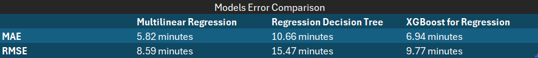

# 🧪 Exploratory Data Analysis

---

## 🔍 Key Patterns

### 🌀 Weather vs Traffic
- After analyzing feature importance across all regression models, **weather conditions** (e.g., rainy, foggy) consistently showed **greater impact** on delivery time than traffic level.
- This may be due to the fact that **2 of the 3 vehicle types (scooter and bike)** are less affected by traffic congestion.
- Investigating the **number of orders by vehicle type** could help validate this hypothesis.

---

### 📏 Distance
- **Distance_km** was the most important predictor across all models.
- Its effect varies depending on the vehicle type used for delivery.

---

### 📈 Error Growth with Delivery Time
- The models perform better with **short delivery times**, but **residuals grow** as the delivery time increases.
- This suggests that the dataset may be **biased toward shorter deliveries**, and the models struggle with long-tail cases.
- Potential improvements:
  - Collect more long-time deliveries.
  - Engineer new features (e.g., number of items, delivery zones).

---

### 🚫 No Clear Linearity
- Even after testing linear and tree-based models, we found **no strong linear relationship** between features and delivery time.
- This may indicate a **non-linear or curved correlation structure**, justifying the use of models like **XGBoost** or **Decision Trees**.

---

### ✅ Best model
-- After testing 3 diferrent regression models we can compare their erros and see which is the one that best fits the data. 

-- The best model would be **Multilinear Regression** with a mean absolute error of 5.82 min. Later I am going to explain on why models considered **"better"** like decision tree or XGBoost are not the best option in this case.

##  Outliers

- We used the **Interquartile Range (IQR)** method to detect outliers.
- Instead of removing them, we **winsorized** the values — replacing them with their respective upper/lower bounds.
- This preserves most of the dataset while limiting the influence of extreme values on the model.

---

## Assumptions

- **Missing Categorical Values:**  
  We replaced them with `'Unknown'`, which allowed us to:
  - Keep the full dataset.
  - Use the "Unknown" label to detect patterns in incomplete or anomalous records.

- **Missing Numeric Values (e.g., Courier_Experience_yrs):**  
  We filled these using the **median**, which is more robust to skewed distributions than the mean.

