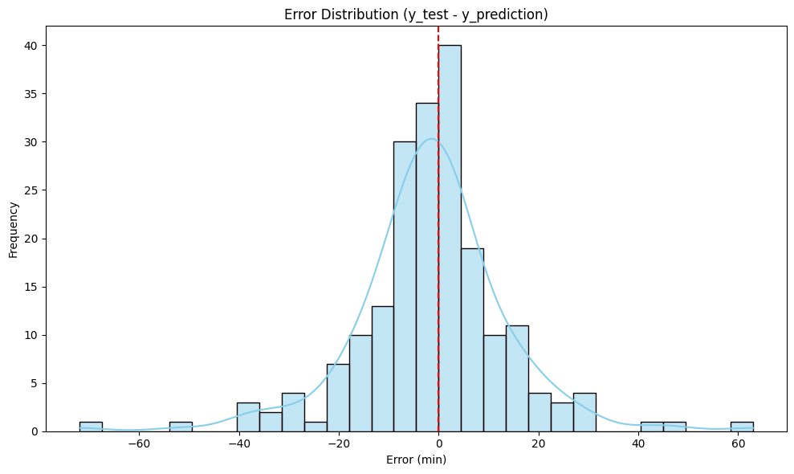

## ✅ Error Insights

---

### 🤔 Why Do XGBoost and Decision Tree Underperform in This Case?

While **XGBoost** and **Decision Tree** are often strong performers in regression problems, in this particular case they showed slightly **higher prediction errors** compared to **Multiple Linear Regression**. This can be surprising, but there are several reasons that help explain this behavior:

1. **Overfitting:**  
   Tree-based models have high variance and can easily overfit, especially without regularization or pruning. In this case, both models may have memorized patterns from the training set that didn’t generalize well.

2. **Skewed Target Distribution:**  
   When comparing the error distribution for each model, we observe a **left-skewed pattern**, indicating that most predictions were low, and the models struggled with longer delivery times. This is a common issue when the target variable (e.g., delivery time) is **not normally distributed**.

     
     
   

3. **Lack of Hyperparameter Tuning:**  
   A critical factor in maximizing performance with XGBoost and Decision Trees is **hyperparameter optimization**. In this analysis, no tuning methods like `RandomizedSearchCV` or `GridSearchCV` were applied. Using these tools to optimize parameters like `max_depth`, `learning_rate`, or `min_samples_leaf` could significantly enhance model performance.

---

### 🚨 When Does the Model Fail?

- The model tends to produce **higher errors for long delivery times**. This is likely due to **data imbalance**, where most observations are concentrated around shorter delivery durations. This bias limits the model’s ability to generalize to rare, longer deliveries.

- **Outlier handling** also plays a role. We used **Winsorization** to cap extreme values, which helps reduce the impact of noise for linear models. However, for tree-based models like XGBoost and Decision Tree — which are generally **robust to outliers** — removing or capping them may have removed valuable signal that could aid prediction.

---

### 💡 Conclusion

Model failure here is not due to the model type itself, but rather to a combination of **data distribution**, **lack of tuning**, and possibly **misaligned preprocessing choices** for tree-based models.
