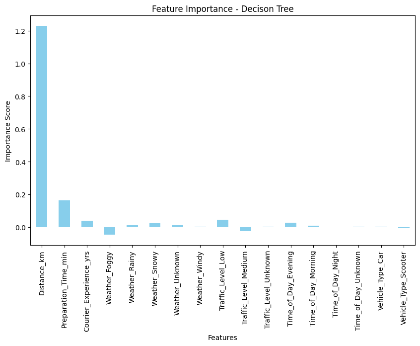
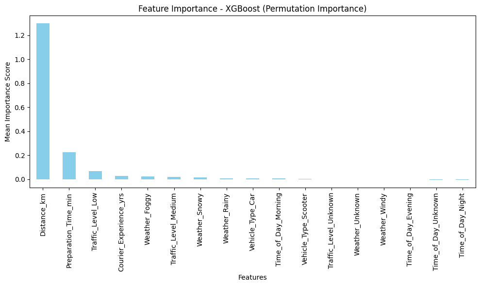
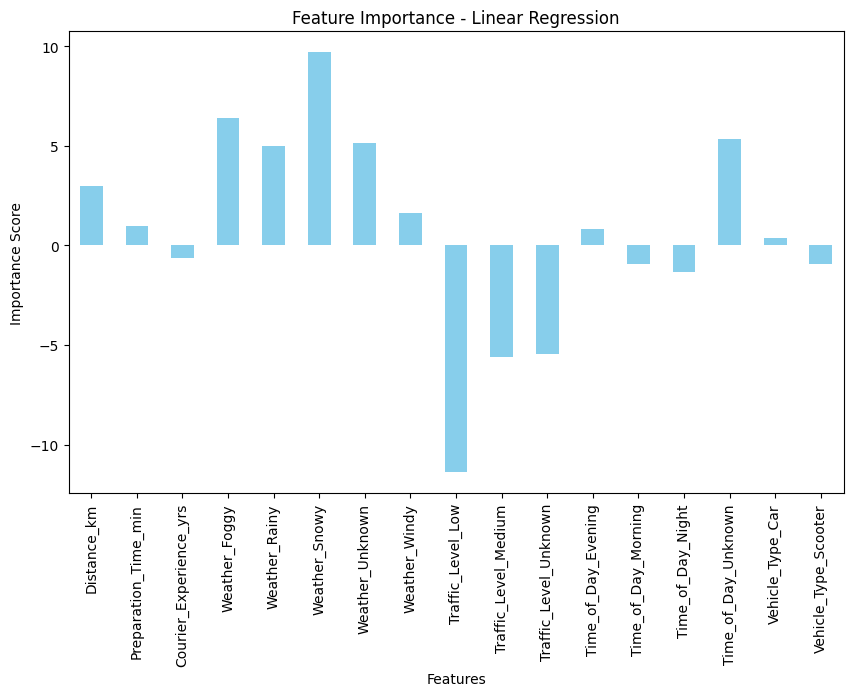

## ✅ Explainability.md

### 🔍 Feature Importance Tools Used:

To interpret how our models make predictions, we used different techniques depending on the algorithm:

- For **Decision Tree** and **XGBoost**, we used:
  - `feature_importances_` to get the raw importance scores based on split gain.
  - `permutation_importance` to measure how shuffling each feature affects model performance.
- For **Multiple Linear Regression**, we used:
  - Model coefficients to understand the direction (positive/negative) and relative weight of each feature.

These tools allowed us to understand which variables had the most influence in predicting delivery time.

---

### ⭐ Top Influential Features:

- **Distance_km**  
  - This was the most impactful feature in Decision Tree and XGBoost, and also relevant in Linear Regression.
  - It confirms that delivery time is heavily dependent on the geographic distance between restaurant and customer.

- **Courier_Experience_yrs**  
  - In tree-based models, courier experience ranked among the top 3 features.
  - While not dominant in Linear Regression, it still contributed meaningfully.
  - This suggests that more experienced couriers tend to be more efficient, even under adverse conditions.

- **Weather Conditions (Rainy, Snowy, Foggy)**  
  - Linear Regression assigned high coefficient weights to these weather types.
  - Tree models also ranked them highly.
  - This supports the idea that poor weather conditions (especially **Rainy** and **Snowy**) can cause significant delivery delays.

---

### 🚦 Traffic Not As Relevant?

While we expected **Traffic_Level** to be a key variable, all three models indicated it was less influential than others.

**Hypothesis:**  
2 out of 3 vehicle types in our dataset are scooters and bikes, which are **less affected by traffic congestion**. As a result, traffic level has a diminished effect on delivery time overall.

This highlights the importance of **interpreting feature importance in the context of business logic and data structure**.

---

### 📊 Visualizations

Below is a sample feature importance chart using permutation importance for the Decision Tree model:

And for XGBoost:

Coefficient values for Linear Regression were also visualized in bar charts to understand positive and negative impacts.

---
